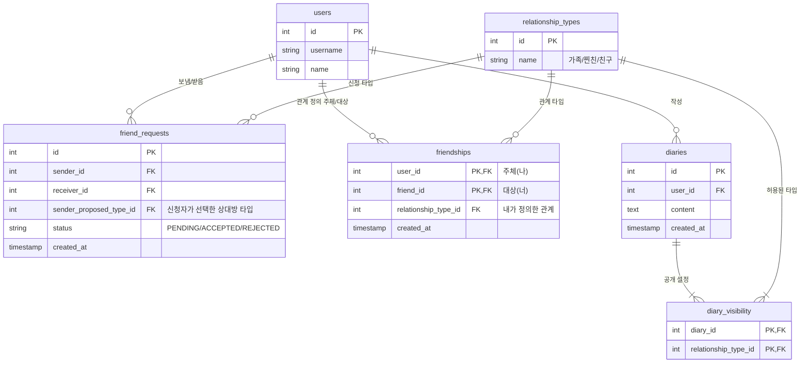

# 친구 관계 시스템 설계 (Friend Relationship System Design)

**작성일**: 2025-12-03
**기반**: Gemini 제안 설계 (V2 - 다중 선택 공개 지원)

## 1. 핵심 개념
- **비대칭 관계 (Asymmetric Relationship)**: A와 B가 친구일 때, A가 B를 생각하는 관계(예: 찐친)와 B가 A를 생각하는 관계(예: 친구)는 다를 수 있습니다.
- **상호 동의 (Mutual Consent)**: 친구 관계는 양쪽의 수락이 있어야 성립합니다.
- **다중 선택 공개 (Multiple Selection Visibility)**: 일기 작성 시 공개 대상을 '가족', '찐친' 등 여러 그룹으로 선택할 수 있습니다.
- **상하 관계 없음 (No Hierarchy)**: 그룹 간 포함 관계는 없습니다. (예: '가족'에게 공개했다고 '찐친'이 자동으로 보는 것은 아님)

## 2. 데이터베이스 스키마 설계

기존 `users` 테이블 및 `diaries` 테이블과의 호환성을 고려하여 컬럼명을 조정했습니다.

### 2.1 ERD 개요


### 2.2 테이블 상세 정의

#### `relationship_types` (관계 타입)
고정된 관계 타입을 관리합니다.
- `id` (PK): Integer (1: 가족, 2: 찐친, 3: 친구)
- `name`: Varchar (예: 'family', 'close_friend', 'friend')
- `display_name`: Varchar (예: '가족', '찐친', '친구')

#### `friend_requests` (친구 신청)
- `id` (PK): Serial
- `sender_id` (FK): 신청 보낸 사람 (`users.id`)
- `receiver_id` (FK): 신청 받는 사람 (`users.id`)
- `sender_proposed_type_id` (FK): 신청자가 정의한 수신자의 관계 타입 (`relationship_types.id`)
- `status`: Varchar ('PENDING', 'ACCEPTED', 'REJECTED')
- `created_at`: Timestamp

#### `friendships` (친구 관계)
**핵심**: A와 B가 친구가 되면 두 개의 행이 생성됩니다. (A->B, B->A)
- `user_id` (PK, FK): 관계의 주체 (`users.id`)
- `friend_id` (PK, FK): 관계의 대상 (`users.id`)
- `relationship_type_id` (FK): 주체가 정의한 대상의 관계 타입 (`relationship_types.id`)
- `created_at`: Timestamp

#### `diary_visibility` (일기 공개 설정)
일기별 공개할 관계 타입을 매핑합니다. (비공개인 경우 데이터 없음, 전체 공개인 경우 별도 플래그 또는 모든 타입 매핑 고려 - 여기서는 타입 매핑 사용)
- `diary_id` (PK, FK): `diaries.id`
- `relationship_type_id` (PK, FK): `relationship_types.id`

## 3. 주요 로직 및 쿼리

### 3.1 친구 신청 수락 시
트랜잭션으로 처리해야 합니다.
1. `friend_requests` 상태를 'ACCEPTED'로 변경.
2. `friendships`에 A -> B 관계 추가 (신청 시 선택한 타입).
3. `friendships`에 B -> A 관계 추가 (수락 시 선택한 타입).

### 3.2 일기 조회 권한 확인 (Feed Query)
사용자 B가 사용자 A의 일기(ID: 555)를 볼 수 있는지 확인하는 로직.

```sql
SELECT d.*
FROM diaries d
WHERE d.id = 555        -- 보고자 하는 일기
  AND d.user_id = 100   -- 작성자 A
  AND EXISTS (
      SELECT 1
      FROM friendships f
      JOIN diary_visibility dv ON f.relationship_type_id = dv.relationship_type_id
      WHERE f.user_id = d.user_id      -- 작성자(A)가
        AND f.friend_id = 200          -- 시청자(B)를 생각하는 관계가
        AND dv.diary_id = d.id         -- 이 일기의 공개 설정에 포함되어야 함
  );
```

## 4. 검토 의견 및 보완 사항
1.  **기존 스키마 호환성**: 기존 `users` 테이블의 PK는 `id`이므로, 제안된 `user_id` 대신 `id` 또는 `user_id`를 FK로 명확히 매핑해야 합니다. 위 설계에서는 FK 컬럼명을 `user_id`, `friend_id` 등으로 명시했습니다.
2.  **전체 공개/비공개 처리**:
    - **비공개**: `diary_visibility`에 데이터가 없으면 작성자 본인만 볼 수 있습니다.
    - **전체 공개**: 모든 친구에게 공개하려면 모든 `relationship_type_id`를 `diary_visibility`에 넣거나, `diaries` 테이블에 `is_public_to_all_friends` 같은 플래그를 두는 것이 효율적일 수 있습니다. (현재 설계는 매핑 테이블 방식 유지)
3.  **친구 끊기**: `friendships` 테이블에서 양방향(A->B, B->A) 데이터를 모두 삭제해야 합니다.

이 문서는 추후 '친구 관계 시스템' 구현 시 상세 명세로 사용됩니다.
